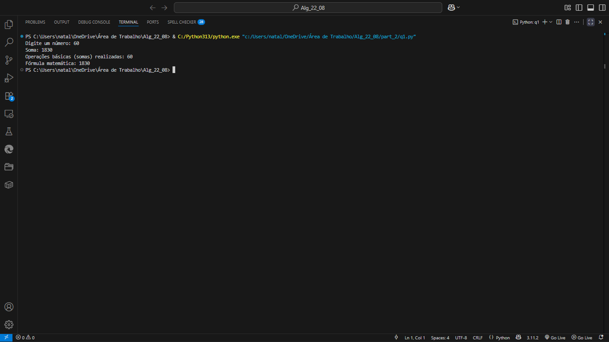
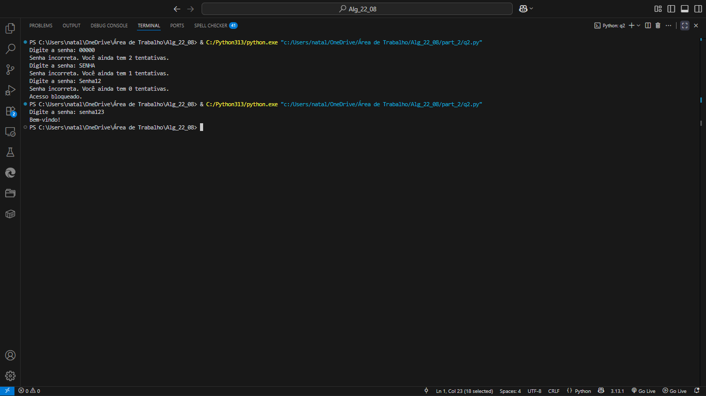
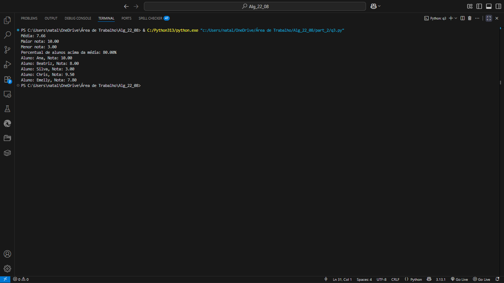
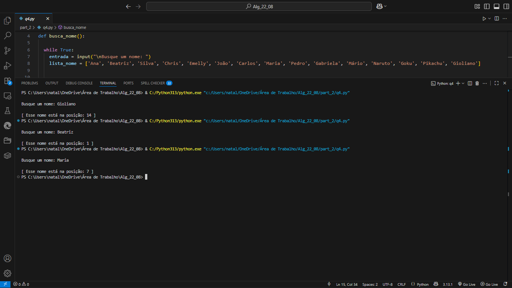

## ALGORITMOS - PARTE 2
Exercícios de Algoritmos 

2º período de Eng. Software 

Aluna: Nayara Emelly P. Mendonça

Turma: A

Professor: Gioliano 

## EXECUTADOS - TERMINAL
q1. Cálculo de Complexidade Simples:

q2. Validação de Login:

q3. Estatísticas de Notas:

q4. Busca Linear:

